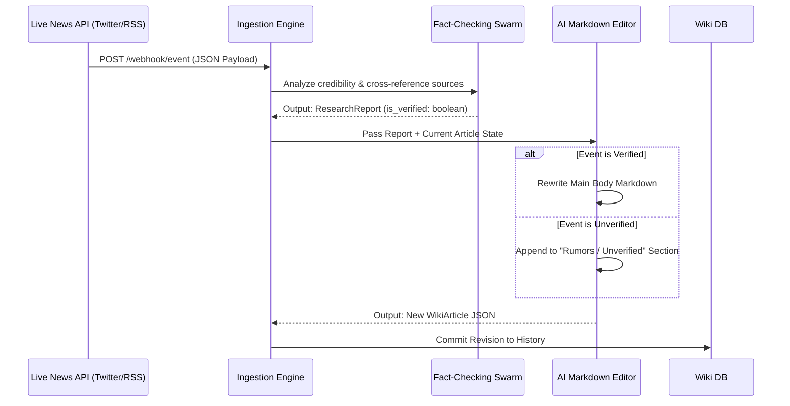

<div align="center">
  <h1>📚 Living Wikipedia</h1>
  <p><b>An autonomous encyclopedia that rewrites its own articles in real-time based on live news streams. Zero human editors.</b></p>
  
  [](https://python.org)
  [](https://fastapi.tiangolo.com/)
  [](https://opensource.org/licenses/MIT)
  [](https://github.com/lakshanmuruganandam/living-wikipedia/graphs/commit-activity)
</div>

---

## 📖 The Vision

Wikipedia is humanity's greatest repository of knowledge, but its reliance on human consensus makes it inherently slow. When a major geopolitical event occurs, breaking news unfolds over minutes, but humans argue on talk pages for hours—or days—before edits go live. 

I envisioned an encyclopedia that updates at the exact speed of the internet. **Living Wikipedia** is an autonomous, multi-agent swarm architecture where Large Language Models (LLMs) replace human editors entirely. The system hooks directly into live webhooks (e.g., X/Twitter streams, Reuters feeds), parses the unstructured data, mathematically calculates credibility, and injects verified facts straight into the active Markdown articles.

## 🚀 Core Architecture

The entire system relies on an asynchronous, multi-agent pipeline designed for sub-second data synthesis.

1. **The Researcher Swarm (`src/agents/researcher.py`)** 
   - Listens to the `POST /webhook/event` ingestion pipeline.
   - Cross-references incoming breaking news across multiple registered "trusted sources."
   - Calculates a strict mathematical `credibility_score`.
   - Emits an internal `ResearchReport` detailing whether the claim is verified or unverified.

2. **The Editor Agent (`src/agents/editor.py`)**
   - Receives the JSON `ResearchReport`.
   - Loads the target Wikipedia article from the database.
   - **Intelligent Formatting:** If the event is verified, the LLM rewrites the main body of the text. If the event is *unverified* (e.g., a viral rumor), the Editor strictly quarantines it in an `## Unverified Claims` section to prevent hallucinations from polluting the primary knowledge base.

### 🧠 Swarm Sequence Diagram


## 🛠️ Quickstart Installation

Ensure you have Python 3.13 installed. 

```bash
# 1. Clone the repository
git clone https://github.com/lakshanmuruganandam/living-wikipedia.git
cd living-wikipedia

# 2. Setup the virtual environment
python3 -m venv .venv
source .venv/bin/activate

# 3. Install the strict dependencies
pip install -r requirements.txt

# 4. Start the autonomous wiki engine on port 8000
uvicorn src.main:app --reload
```

Navigate to `http://127.0.0.1:8000/docs` to interact with the Swagger UI and manually fire webhooks into the swarm.

## 🧪 Testing the Swarm
Because the system writes its own database entries, we employ strict `pytest-asyncio` testing to ensure the LLMs do not hallucinate outside their bounds.
```bash
pytest tests/ -v
```

## 🛣️ Roadmap
- [x] Base Fact-Checking Algorithm
- [x] Autonomous Markdown Rewriting
- [x] FastAPI Webhook Ingestion
- [ ] Implement Pinecone / Vector DB for long-term historical context.
- [ ] Connect directly to X Developer API for live ingestion.

## 🤝 Contributing
Want to build a stricter fact-checking model or optimize the Pydantic schemas? Open a Pull Request! All contributions are welcome.

---
*Built with ❤️ by Lakshan Muruganandam | MIT Licensed*
