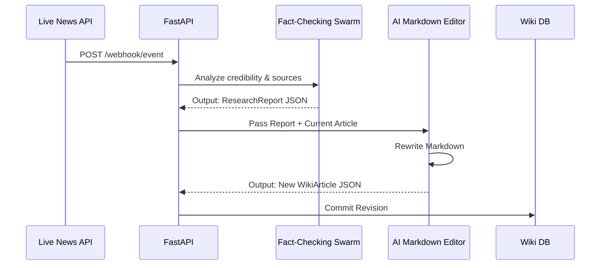

<div align="center">
  <h1>📚 Living Wikipedia</h1>
  <p><b>An autonomous encyclopedia that rewrites its own articles in real-time based on live news streams. Zero human editors.</b></p>
  
  
  
</div>

## 📖 The Story
Wikipedia is incredible, but it's slow. When breaking news happens, humans have to argue on talk pages for hours before an edit goes live. 

I wanted an encyclopedia that updates at the speed of the internet. So I built **Living Wikipedia**—an autonomous swarm of LLM agents that hook into live news feeds, fact-check the claims, and rewrite markdown articles dynamically. 

## 🚀 How it Works
1. **The Researcher Swarm:** Ingests live webhooks (e.g., from Twitter/X or News APIs), scrapes the sources, and calculates a `credibility_score`. If corroborated, it flags the event as verified.
2. **The Editor Agent:** Receives the research report and autonomously rewrites the target article's Markdown, intelligently placing verified facts in the main body and unverified rumors in a quarantine section.

### 🧠 Swarm Architecture


## 🛠️ Quickstart

```bash
# 1. Clone the repository
git clone https://github.com/lakshanmuruganandam/living-wikipedia.git
cd living-wikipedia

# 2. Setup the virtual environment
python3 -m venv .venv
source .venv/bin/activate

# 3. Install dependencies
pip install -r requirements.txt

# 4. Start the autonomous wiki engine
uvicorn src.main:app --reload
```

## 📦 Tech Stack
- **FastAPI:** Lightning-fast webhook ingestion.
- **Pydantic V2:** Strict schema validation to prevent hallucinations from corrupting the database.
- **Pytest-Asyncio:** Because testing LLMs that write their own documentation is terrifying.

## 🤝 Contributing
Feel free to open a PR to add new fact-checking algorithms!

---
*Built with ❤️ by Lakshan Muruganandam*
